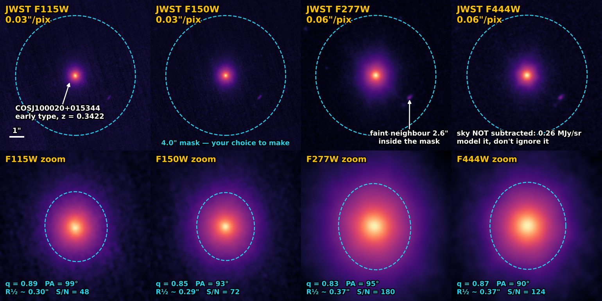

# PyAutoGalaxy Assistant

This repository is the **PyAutoGalaxy Assistant**: an AI assistant which **lets you use
natural language** to do galaxy structure and morphology science with
[PyAutoGalaxy](https://github.com/PyAutoLabs/PyAutoGalaxy) — fitting the light of galaxies
in imaging and interferometer data. Surface-brightness profiles, multi-Gaussian expansions,
bulge–disk decomposition, isophote and ellipse fitting, pixelised reconstructions of clumpy
galaxies, and multi-wavelength analysis.

## Getting Started

To illustrate the `autogalaxy_assistant` we will use James Webb Space Telescope NIRCam
imaging of **COSJ100020+015344**, a galaxy whose four-band cutout ships with this
repository in `dataset/imaging/cosj100020+015344`:



This is a **single bright, smooth, early-type galaxy** at a spectroscopic redshift of
z = 0.3422 — one object, four wavebands, no complications from a companion of comparable
brightness. That makes it a clean first target, and it also makes the three things you *do*
have to decide impossible to hide behind:

- **How far out does your mask reach?** A mask that truncates the outer isophotes biases the
  effective radius and Sersic index directly, so the 4" circle drawn above is an opening
  suggestion rather than an answer. Your first interactions with the assistant will ask you
  about it.
- **The sky has not been subtracted.** The delivered data carry the real JWST background as a
  positive pedestal — 5 to 19 times the noise, depending on the band. A light-profile fit
  that ignores it absorbs the pedestal into the profile wings and hands back an inflated size
  and Sersic index. Free `background_sky_level` on an `af.Model(ag.DatasetModel)`, or subtract
  the measured value first.
- **There is a faint neighbour 2.6" from the centre**, inside any mask wide enough to reach
  the galaxy's outer light. It has to be masked or modelled, not ignored.

The galaxy's own measured shape — axis ratio ~0.83–0.89 and position angle ~90–99°, drifting
with wavelength — is in the zoom row above, and every number in the figure is read straight
from the dataset's `info.json`. The full provenance, from MAST exposures through the
reduction to each measurement, is in
[the dataset's README](dataset/imaging/cosj100020+015344/README.md) — **including the PSF
caveat that matters most**: the shipped kernel is a model (STPSF) PSF rather than an
empirical one, and it is the dominant systematic in any fit to this data.

### Setting up the assistant

The assistant runs inside an **AI coding agent** — a tool that reads this repository, executes Python on your
computer and inspects the results. That is what lets it install **PyAutoGalaxy**, plot your `.fits` data, run galaxy
models and look at the figures they produce. You do not have to run anything to use it: asking questions, planning an
analysis, discussing a paper or learning in Teacher Mode all happen inside the same agent.

1. **Choose Claude Code or Codex.** These are the two recommended agents and the ones the assistant is developed and
   tested against. Their setup pages live in the sibling assistant and apply here with this repository's URL:
   [Claude Code](https://github.com/PyAutoLabs/autolens_assistant/blob/main/docs/setup/claude_code.md) ·
   [Codex](https://github.com/PyAutoLabs/autolens_assistant/blob/main/docs/setup/codex_cli.md). For sustained
   scientific work expect to pay for one of them, but how depends on your situation: a personal subscription, access
   through your institution or team, or usage-based API billing. Check the provider's current plans rather than
   assuming a subscription is the only route. Desktop and IDE versions of either agent are fine, provided they can
   read this repository and execute code.
2. **Open the assistant workspace.** Clone this repository and start the agent inside it — the instructions load
   automatically, and the assistant installs PyAutoGalaxy for you if it is missing:

   ```bash
   git clone https://github.com/PyAutoLabs/autogalaxy_assistant.git
   cd autogalaxy_assistant
   claude        # or: codex
   ```

3. **Submit one of the starter prompts** below.

If you cannot use either agent, OpenCode is an **experimental alternative** — see
[Experimental alternatives](#experimental-alternatives) for what that does and does not mean.

## Two Starter Prompts

Both are grounded on the bundled dataset, so they work immediately after cloning — copy,
paste, and go.

### Starter Prompt 1 — new to PyAutoGalaxy

Plot the data, then get the lie of the land before committing to a model. This is the prompt
to use if you have not fitted a surface-brightness profile before; the assistant will lead
with the physics and point you at the tutorial series.

```
Find the bundled JWST imaging of the galaxy COSJ100020+015344 in
dataset/imaging/cosj100020+015344, give me a short script that plots all four wavebands,
and then — since I'm new to PyAutoGalaxy — give me an overview of the different ways we
could model the structure of an early-type galaxy at z = 0.34.
```

### Starter Prompt 2 — experienced user, end-to-end fit

A real multi-band structural measurement, including the sky pedestal this data actually
has. Expect the assistant to ask you about the mask extent and the faint neighbour before
it starts fitting — that gate is deliberate and is not waived on any harness.

```
Assistant mode.

Fit the JWST F277W imaging in dataset/imaging/cosj100020+015344 with a multi-Gaussian
expansion (MGE) bulge, freeing the background sky level — the sky is not subtracted in
this data. Report the effective radius, axis ratio and position angle, add a single-Sersic
fit so I get a Sersic index to compare against, and then tell me how the recovered
structure changes across the other three wavebands.
```

This prompt is also shipped as a frozen benchmark card,
[`benchmarks/prompts/easy_cosj100020_imaging.md`](benchmarks/prompts/easy_cosj100020_imaging.md),
with a scoring rubric — the two texts are kept identical by a unit test.

## Customize Your Assistant

`autogalaxy_assistant` adapts its behaviour to suit your prompt:

- Want to plan your analysis and compare the available approaches before running anything?
  Simply say so in your opening prompt.

- Want the assistant to ask questions as it goes, helping you understand the analysis and
  make informed choices? Ask it to guide you through the process.

- Want it to complete a task end-to-end without consulting you? Tell it to **one-shot** the
  task.

If you are new to galaxy structure and morphology — particularly an undergraduate or
early-stage PhD student — ask the assistant to use **Teacher Mode**. It will explain the
fundamentals of surface-brightness fitting in greater detail, and link you to relevant,
human-readable documentation so you can see what **PyAutoGalaxy** is doing.

## What Works Today, and What Is Coming

This assistant was **built in public, in phases**, so this section is a status report rather
than a feature list. Every phase has now landed; [`ROADMAP.md`](ROADMAP.md) is what comes next
and what is deliberately not here yet. No file in this repository links to something that does
not exist.

**Live today:**

- **The core modelling loop — nine skills.** Environment setup, imaging data preparation,
  dataset simulation, model building, search configuration, running the fit, plotting the
  fit, loading results, and debugging a failed fit. A galaxy-science request routes into
  these.
- **The features beyond a single smooth profile — eight skills.** Basis profiles and MGE,
  pixelised reconstruction, extra galaxies / sky / operated profiles, ellipse fitting,
  multi-dataset fits, interferometer modelling, multi-galaxy and cluster fields, and search
  chaining.
- **Two output surfaces.** Converting a generated script into a Jupyter notebook, and a
  read-only results-inspector MCP server for browsing and comparing your finished fits from a
  client with no code execution. Alongside all three sets sit two meta-skills, two
  project-workflow skills, one literature skill and three repository-maintenance skills —
  twenty-seven in total, catalogued in [`skills/README.md`](skills/README.md).
- **The curated reference wiki**, [`wiki/core/`](wiki/core/index.md) — 39 pages across
  `stack/`, `api/`, `concepts/`, `operations/` and `external/`. Every page pins the source
  commits it was validated against.
- **The literature wiki**, [`wiki/literature/`](wiki/literature/index.md) — a galaxy-structure
  science reference: 16 concept pages, 10 survey/instrument entities and 13 annotated source
  bibliographies over a BibTeX layer in which **every entry was verified against a public
  record before it was allowed in**.
- **This bundled dataset** — four real JWST NIRCam wavebands with full provenance, plus
  [`wiki/core/operations/dataset.md`](wiki/core/operations/dataset.md) documenting the
  on-disk layout and the `info.json` schema.
- **Cluster support** — `hpc/` ships a pipeline template, CPU and GPU SLURM submit templates
  and a `sync` CLI for transfers and job control, documented in
  [`wiki/core/operations/hpc.md`](wiki/core/operations/hpc.md) and
  [`hpc_infrastructure.md`](wiki/core/operations/hpc_infrastructure.md).
- **Four benchmark cards** — easy (Starter Prompt 2 above), medium, hard and teacher, each
  frozen with a 100-point rubric under [`benchmarks/`](benchmarks/README.md).

**The honest gap:** the benchmark suite has been *written* but not *run*.
[`benchmarks/RESULTS.md`](benchmarks/RESULTS.md) records no scored runs, and it is regenerated
mechanically rather than written by hand — so there is no performance claim here to believe or
disbelieve yet. That, and everything else this assistant does not do, is in
[`ROADMAP.md`](ROADMAP.md).

The phased build is tracked at
[PyAutoBrain#188](https://github.com/PyAutoLabs/PyAutoBrain/issues/188).

## Experimental alternatives

**Conversational chat routes are no longer supported.** Ordinary ChatGPT or Claude chat with a GitHub connector, the
sibling PyAutoLens custom GPT and uploaded knowledge packs were previously offered as ways to use the assistant. They
cannot execute code or inspect data, so the safeguards the assistant relies on (current-API verification, looking at
the data before fitting, checking results) could not be enforced. The old README text is kept with an unsupported
notice under [`docs/archive/`](docs/archive/), and is not maintained.

**OpenCode** is an open-source coding agent whose *client* is free. Model access is separate: you connect it to a
provider, and the cost, capability and availability of the model are the provider's, not OpenCode's. Some providers
offer free models, often as limited-time offerings, and not every model can drive the assistant — it must handle
multi-step tool use and be able to look at figures, which free models frequently cannot. **No free provider/model
configuration has yet been validated against this assistant's benchmarks**, so treat OpenCode as compatible rather
than tested. Setup and caveats are on the sibling assistant's
[OpenCode page](https://github.com/PyAutoLabs/autolens_assistant/blob/main/docs/setup/opencode_cli.md); use this
repository's URL. Please report what worked (and what did not) in an
[issue](https://github.com/PyAutoLabs/autogalaxy_assistant/issues).

Maintainer-facing notes on evaluating further agents (including Gemini CLI, which this repository's
`.gemini/settings.json` still points at `AGENTS.md`) are in the sibling assistant's
[`docs/evaluation/agent_evaluation.md`](https://github.com/PyAutoLabs/autolens_assistant/blob/main/docs/evaluation/agent_evaluation.md).

## Science Project

When you begin a specific scientific study, `autogalaxy_assistant` can create a dedicated
**science project**: a separate, logically structured repository holding that study's
datasets, configuration, analysis scripts, results, plotting scripts and the transcript of
your work with the assistant. Every generated script is documented well enough to convert
automatically into a Jupyter notebook, its explanations becoming markdown cells. Linking it
to GitHub gives collaborators a straightforward way to inspect the project's state and build
on it, and if the study leads to a paper the repository can serve as its open-source
companion.

The assistant itself stays the copilot; the project is its own repo. To start one, just say
so:

```
Start a science project for my COSJ100020+015344 structural analysis.
```

The workflow is owned by the
[`start-new-project`](skills/start-new-project.md) skill.

## The Sibling Assistant

If your science is strong gravitational lensing rather than galaxy structure, the mature
sibling assistant is
[autolens_assistant](https://github.com/PyAutoLabs/autolens_assistant) — same architecture,
built on PyAutoLens. The two are independent; use whichever matches your science.

## License

This repository is released under the [MIT License](LICENSE), consistent with the wider
PyAuto\* ecosystem. The assistant ships agent instructions and reference material derived
from the public PyAuto\* repositories; the underlying libraries are released under their own
licenses (see each repo). The bundled dataset was reduced from public JWST archival
observations — see
[its README](dataset/imaging/cosj100020+015344/README.md) for the archive identifiers and
catalogue citations.

<sub><i><a href="https://open.spotify.com/track/6LeTQu4NvTnLRRiB8GVFQe">if you don't know, don't worry</a></i></sub>
